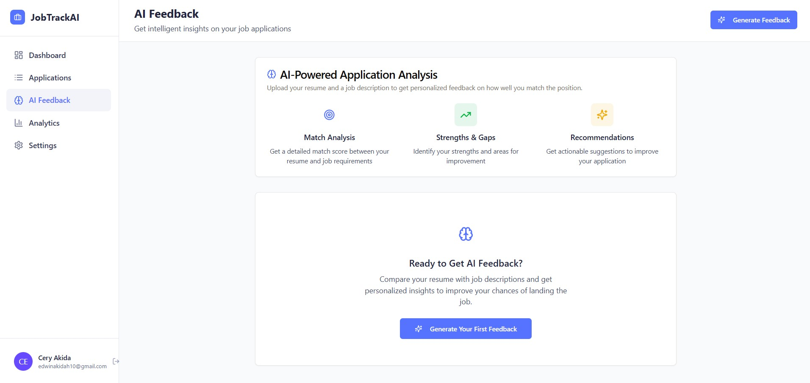

# 🚀 JobTrackAI

> **Track Applications. Land Your Dream Job.** 

Transform your job search from chaos to clarity with AI-powered insights, smart tracking, and breakthrough analytics that actually help you get hired.



## ✨ Why JobTrackAI?

Job searching is overwhelming. Spreadsheets are outdated. Generic advice doesn't work. **JobTrackAI changes everything.**

- 🎯 **AI-Powered Application Review** - Get instant feedback comparing your resume to job descriptions
- 📊 **Smart Analytics** - Visualize success rates, identify trends, optimize your approach
- 🔄 **Real-Time Tracking** - Monitor applications with intelligent status updates
- 📈 **Success Insights** - Learn what works, what doesn't, and how to improve
- 🎨 **Beautiful Interface** - Clean, modern design that makes job hunting actually enjoyable

## 🏆 Success Stories

> *"JobTrackAI helped me land a senior developer position after just 14 applications. The AI feedback feature was a game-changer."* - **Alex T., Software Engineer**

> *"I was applying to dozens of jobs with no callbacks until I started using JobTrackAI. The insights helped me improve my resume dramatically."* - **Sophia K., Marketing Manager**

> *"As someone switching careers, JobTrackAI was invaluable. It helped me track my progress and stay motivated throughout my job search."* - **Marcus J., Data Analyst**

## 🛠️ Tech Stack

**Frontend Magic:**
- ⚛️ **React 18** with TypeScript
- 🎨 **Tailwind CSS** for stunning designs
- 🎭 **Framer Motion** for smooth animations
- 🏗️ **Vite** for lightning-fast development
- 📦 **Wouter** for minimal routing
- 🎯 **Lucide React** for beautiful icons

**Backend Power:**
- 🟢 **Node.js** with Express
- 🗄️ **MongoDB** for data persistence
- 🧠 **OpenAI Integration** for AI insights
- 🔐 **Secure Authentication** system
- ☁️ **Cloud Storage** for file management

**Developer Experience:**
- 📝 **TypeScript** everywhere
- 🎨 **ESLint + Prettier** for code quality
- 🔧 **Hot Module Replacement**
- 📱 **Responsive Design**
- ♿ **Accessibility First**

## 🚀 Quick Start

### Prerequisites
- Node.js 18+ 
- MongoDB (local or cloud)
- OpenAI API key

### Installation

```bash
# Clone the repo
git clone https://github.com/yourusername/JobTrackAI.git
cd JobTrackAI

# Install dependencies
npm install

# Set up environment variables
cp .env.example .env
# Edit .env with your configurations

# Start development server
npm run dev
```

### Environment Variables


## 📁 Project Structure

```

```

## 🎯 Core Features

### 📊 Dashboard Analytics
- **Application Overview** - See all your applications at a glance
- **Success Rate Tracking** - Monitor your interview-to-offer ratio
- **Timeline Visualization** - Track application progress over time
- **Response Rate Analysis** - Identify which strategies work best

### 🤖 AI-Powered Insights
- **Resume Optimization** - Get tailored suggestions for each application
- **Job Match Scoring** - See how well you fit each position
- **Application Feedback** - Understand why applications succeed or fail
- **Market Insights** - Learn about industry trends and salary ranges

### 📝 Application Management
- **Smart Categorization** - Organize applications by status, priority, and more
- **Document Storage** - Keep resumes, cover letters, and notes in one place
- **Interview Preparation** - Track interview schedules and preparation notes
- **Follow-up Reminders** - Never miss an important follow-up

### 📈 Progress Tracking
- **Real-time Updates** - See changes as they happen
- **Goal Setting** - Set and track weekly/monthly application goals
- **Milestone Celebrations** - Celebrate your wins along the way
- **Progress Reports** - Generate detailed reports of your job search

## 🎨 Design Philosophy

JobTrackAI isn't just functional—it's **beautiful**. We believe job searching should be empowering, not demoralizing.

- **Clean Minimalism** - Focus on what matters without clutter
- **Smooth Animations** - Delightful micro-interactions throughout
- **Accessibility First** - Usable by everyone, everywhere
- **Mobile Responsive** - Perfect experience on any device
- **Dark Mode Ready** - Easy on the eyes during late-night applications

## 🔧 Development

### Available Scripts

```bash
# Development
npm run dev          # Start development server
npm run build        # Build for production
npm run preview      # Preview production build
npm run lint         # Run ESLint
npm run type-check   # TypeScript validation

# Database
npm run db:seed      # Seed database with sample data
npm run db:reset     # Reset database to initial state

# Testing
npm run test         # Run unit tests
npm run test:e2e     # Run end-to-end tests
npm run test:watch   # Run tests in watch mode
```

### Contributing

We love contributions! Here's how to get started:

1. **Fork the repository**
2. **Create a feature branch** (`git checkout -b feature/amazing-feature`)
3. **Make your changes** (follow our coding standards)
4. **Write tests** (we aim for 80%+ coverage)
5. **Commit your changes** (`git commit -m 'Add amazing feature'`)
6. **Push to the branch** (`git push origin feature/amazing-feature`)
7. **Open a Pull Request**

### Coding Standards

- Use **TypeScript** for all new code
- Follow **ESLint** and **Prettier** configurations
- Write **meaningful commit messages**
- Add **JSDoc comments** for complex functions
- Include **tests** for new features
- Follow **React best practices**

## 🚀 Deployment

### Production Build

```bash
# Build the application
npm run build

# The client build will be in client/dist/
# The server can be started with npm start
```

### Docker Deployment

```bash
# Build and run with Docker Compose
docker-compose up --build

# Or build individual containers
docker build -t jobtrack-client ./client
docker build -t jobtrack-server ./server
```

### Environment Setup

**Production Environment Variables:**
- Set `NODE_ENV=production`
- Use strong `JWT_SECRET` and `SESSION_SECRET`
- Configure production MongoDB connection
- Set up proper CORS origins
- Enable SSL/HTTPS

## 🔒 Security

JobTrackAI takes security seriously:

- 🔐 **JWT Authentication** - Secure token-based auth
- 🛡️ **Input Validation** - All inputs sanitized and validated
- 🌐 **CORS Protection** - Proper cross-origin resource sharing
- 🔒 **Password Hashing** - Bcrypt with salt rounds
- 🛡️ **SQL Injection Prevention** - Parameterized queries
- 🔐 **XSS Protection** - Content Security Policy headers

## 📊 Performance

- ⚡ **Lighthouse Score: 95+** - Optimized for speed
- 📱 **Mobile First** - Responsive on all devices
- 🎨 **Code Splitting** - Lazy loading for optimal performance
- 📦 **Bundle Optimization** - Tree shaking and minification
- 🖼️ **Image Optimization** - WebP format with fallbacks
- 🚀 **CDN Ready** - Optimized for global delivery

## 🌟 Roadmap

### 🔜 Coming Soon
- [ ] **Calendar Integration** - Sync with Google/Outlook calendars
- [ ] **Email Templates** - Pre-built follow-up email templates
- [ ] **Salary Tracking** - Track and analyze salary negotiations
- [ ] **Network Mapping** - Visualize your professional network
- [ ] **Chrome Extension** - Apply and track jobs from any site

### 🎯 Future Plans
- [ ] **Mobile App** - Native iOS and Android applications
- [ ] **Team Collaboration** - Share insights with career coaches
- [ ] **Advanced AI** - Personalized job recommendations
- [ ] **Integration Hub** - Connect with LinkedIn, Indeed, and more
- [ ] **Video Interview Prep** - AI-powered interview practice

## 🤝 Community

Join our growing community of job seekers and career professionals:

- 💬 **Discord** - [Join our server](https://discord.gg/jobtrackAI) for real-time chat
- 🐦 **Twitter** - [@JobTrackAI](https://twitter.com/jobtrackAI) for updates
- 📧 **Newsletter** - [Subscribe](https://jobtrackAI.com/newsletter) for tips
- 📝 **Blog** - [Read our blog](https://jobtrackAI.com/blog) for career advice
- 🎥 **YouTube** - [Watch tutorials](https://youtube.com/jobtrackAI) and tips

## 📄 License

This project is licensed under the **MIT License** - see the [LICENSE](LICENSE) file for details.

## 🙏 Acknowledgments

- **OpenAI** - For powering our AI insights
- **Tailwind CSS** - For the amazing design system
- **Framer Motion** - For smooth animations
- **MongoDB** - For reliable data storage
- **Vercel** - For seamless deployment
- **Our Beta Testers** - For invaluable feedback

## 💖 Support

If JobTrackAI helped you land your dream job, consider:

- ⭐ **Starring this repository**
- 🐦 **Sharing on social media**
- 📝 **Writing a review**
- 💝 **Sponsoring development**
- 🤝 **Contributing code**

---


